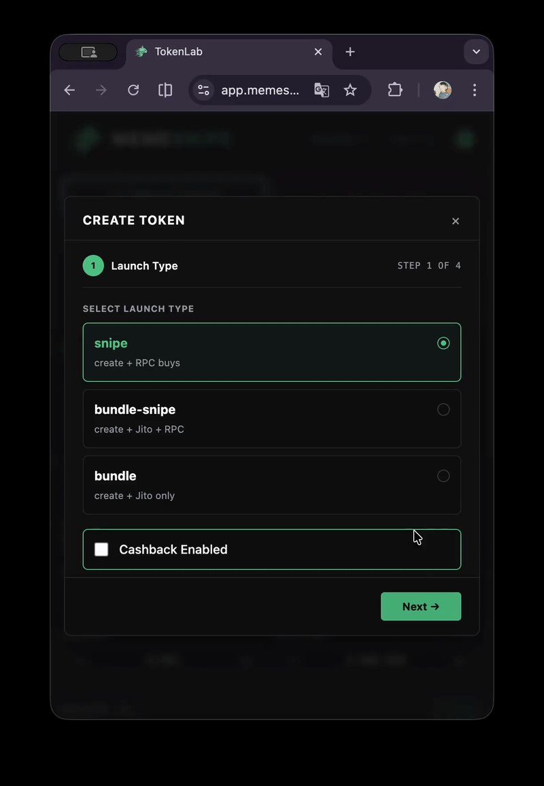
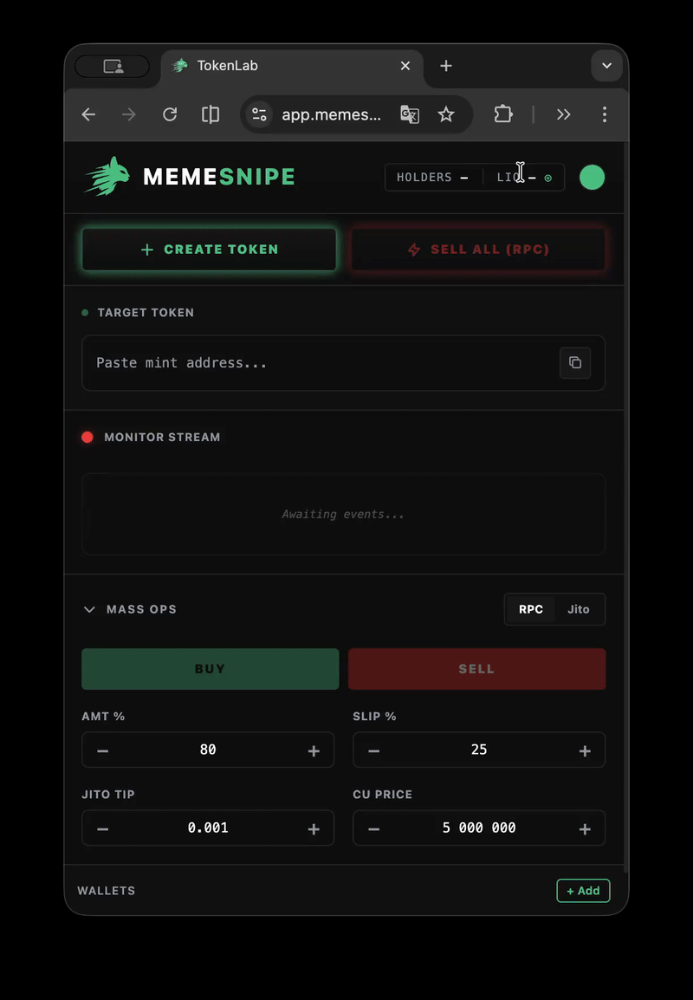
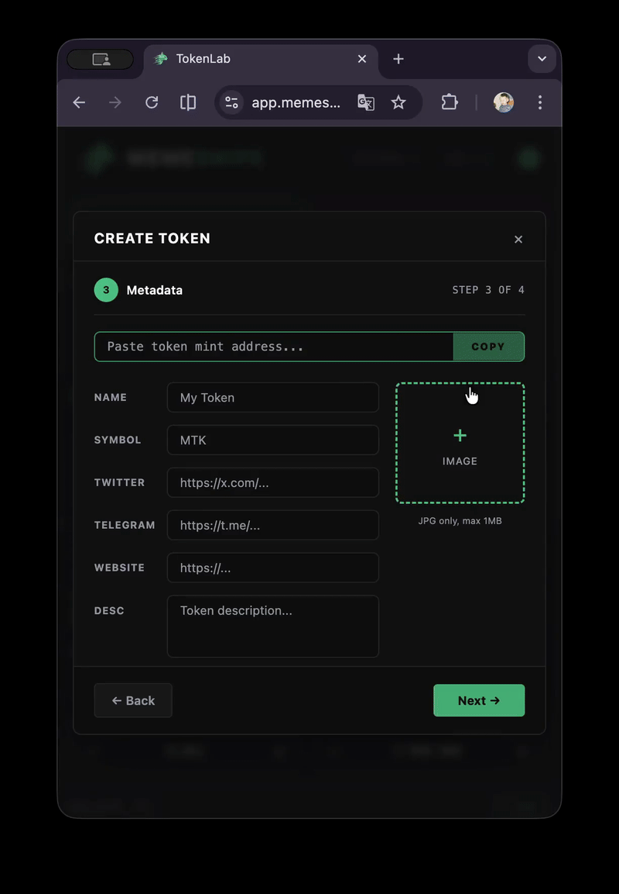
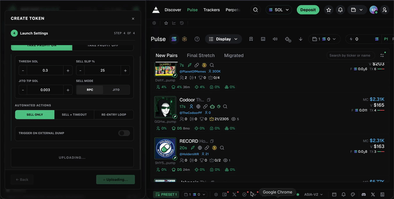
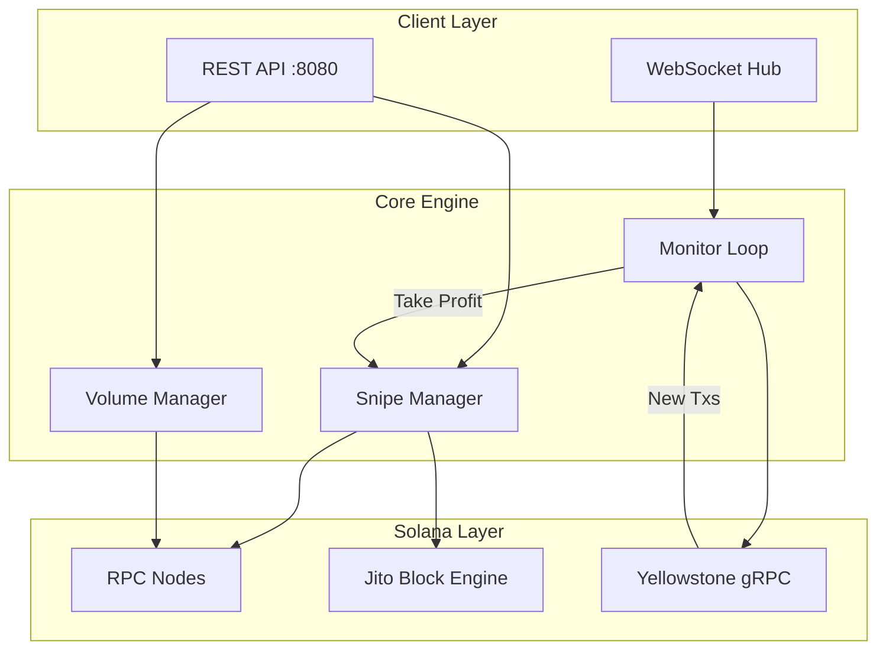

<div align="center">

# PumpFun Sniper Bot

**The fastest Solana pump.fun sniper bot with multi-wallet sniping, Jito MEV bundles, and automated volume strategies**

[](https://solana.com)
[](https://go.dev)
[]()

[Get Access](https://memesnipe.fun) · [Features](#features) · [Demo](#demo) · [Architecture](#architecture)

</div>

---

## What is PumpFun Sniper Bot?

A high-performance Go trading bot built for [pump.fun](https://pump.fun) on Solana. Snipe new token launches across multiple wallets simultaneously, execute MEV-protected bundle transactions via Jito, and run automated volume strategies — all through a clean REST API.

Built for traders who need sub-second execution on memecoin launches.

---

## Features

- **Multi-Wallet Coordinated Sniping** — Atomic launches with parallel RPC buys across wallets. Fastest entry on new pump.fun tokens.
- **Jito MEV Bundle Protection** — Batch transactions through Jito's private mempool. Zero front-running, minimal slippage.
- **Real-Time WebSocket Monitoring** — Live transaction streaming with automated take-profit and stop-loss triggers.
- **Bonding Curve Trading** — Fast on-chain price calculations without RPC lookups. Deterministic, low-latency execution.
- **Volume Bot Strategies** — Automated buy/sell cycles across wallets to generate organic-looking volume on pump.fun tokens.
- **REST API Control** — Full HTTP API for programmatic control. Integrate with your own dashboard or scripts.

> See [FEATURES.md](FEATURES.md) for detailed breakdown with API examples.

---

## Demo

<div align="center">

| Instant Token Launch | Interactive Design | Fast Copying |
|:---:|:---:|:---:|
|  |  |  |
| Deploy to pump.fun in seconds | Premium trading interface | One-click wallet and CA copying |

</div>

---

## Perfect Side-by-Side

Our deeply optimized compact design is built to snap cleanly alongside your favorite analytics platform.

> Keep **Axiom, GMGN,** or any other chart open while keeping full control of your snipes in **1/3 perfectly scaled screen real-estate.**



---

## Architecture



---

## How It Works

```
1. Monitor    → Yellowstone gRPC streams all pump.fun transactions in real-time
2. Detect     → New token launch detected, bonding curve parsed
3. Evaluate   → Market cap, liquidity, creator history checked in <50ms
4. Execute    → Multi-wallet snipe via Jito bundle OR parallel RPC
5. Manage     → Auto take-profit/stop-loss via WebSocket monitoring
```

---

## Code Preview

### Bonding Curve Data Structure
```go
type BondingCurve struct {
    VTR, VSR, RTR, RSR, TTS uint64
    Complete                bool
    Creator                 solana.PublicKey
    IsCashbackCoin          bool
}
```

### Snipe Request API
```go
type SnipeFireRequest struct {
    TokenID     string   `json:"tokenId"`
    Wallets     []string `json:"wallets"`
    BuyPercent  float64  `json:"buyPercent"`
    SlippageBps uint16   `json:"slippageBps"`
    DevBuySOL   float64  `json:"devBuySOL"`
}

type BundleSnipeFireRequest struct {
    TokenID            string   `json:"tokenId"`
    Wallets            []string `json:"wallets"`
    JitoTipSOL         float64  `json:"jitoTipSOL"`
    RpcFallbackDelayMs int64    `json:"rpcFallbackDelayMs"`
}
```

### Real-Time Monitor
```go
type MonitorState struct {
    TokenID    string
    CreatedAt  time.Time
    LastTxTime time.Time
    TxCount    int64
    Profit     float64
}

type wsHub struct {
    mu        sync.RWMutex
    clients   map[string]map[*wsClient]bool
    broadcast chan wsMessage
}
```

---

## Performance

| Metric | Value |
|--------|-------|
| Snipe latency (RPC) | ~150ms |
| Snipe latency (Jito bundle) | ~200ms |
| WebSocket event processing | <10ms |
| Concurrent wallets | Up to 20 |
| Uptime (production) | 99.9% |

---

## Getting Started

PumpFun Sniper Bot is available as a **compiled binary** with beta access licensing.

### Quick Start
1. **Purchase beta access** at [memesnipe.fun](https://memesnipe.fun)
2. Receive your license key via email
3. Open [app.memesnipe.fun](https://app.memesnipe.fun) — no setup, no binary, fully online
4. Enter your key and start sniping

---

## API Endpoints

| Method | Endpoint | Description |
|--------|----------|-------------|
| POST | `/api/snipe/fire` | Execute multi-wallet snipe |
| POST | `/api/snipe/bundle-fire` | Execute Jito bundle snipe |
| POST | `/api/volume/start` | Start volume bot cycle |
| POST | `/api/sell/bundle` | Bundle sell across wallets |
| GET  | `/api/monitor/ws` | WebSocket monitoring stream |
| GET  | `/api/token/:id` | Token bonding curve data |

> Full API reference with curl examples in [FEATURES.md](FEATURES.md)

---

## FAQ

**Is this open source?**
No. The bot is distributed as a compiled binary with a commercial license. This repo contains documentation, architecture details, and code previews.

**What chains are supported?**
Solana only, specifically optimized for pump.fun token launches.

**How fast is the sniper?**
Sub-200ms from token detection to buy execution with Jito bundles. Under 150ms with direct RPC.

**Can I run multiple instances?**
One license per server. Contact us for team pricing.

---

## Get Access

<div align="center">

### Ready to snipe pump.fun launches?

[](https://memesnipe.fun)

**Pay with 300+ cryptocurrencies · Instant delivery · 24/7 support on Discord**

</div>

---

## Disclaimer

This software is provided for educational and research purposes. Trading cryptocurrencies involves significant risk. Past performance does not guarantee future results. Users are responsible for compliance with local regulations. The developers are not liable for financial losses incurred through use of this software.

---

<div align="center">
<sub>Built with Go · Powered by Solana · Protected by Jito</sub>
</div>
